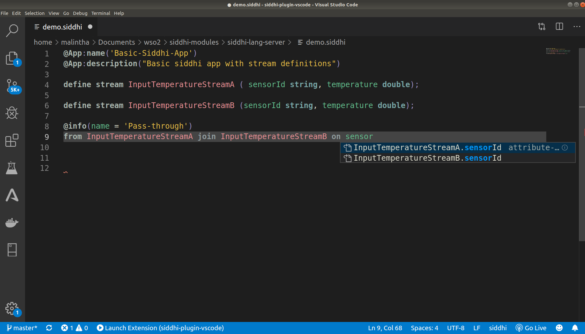
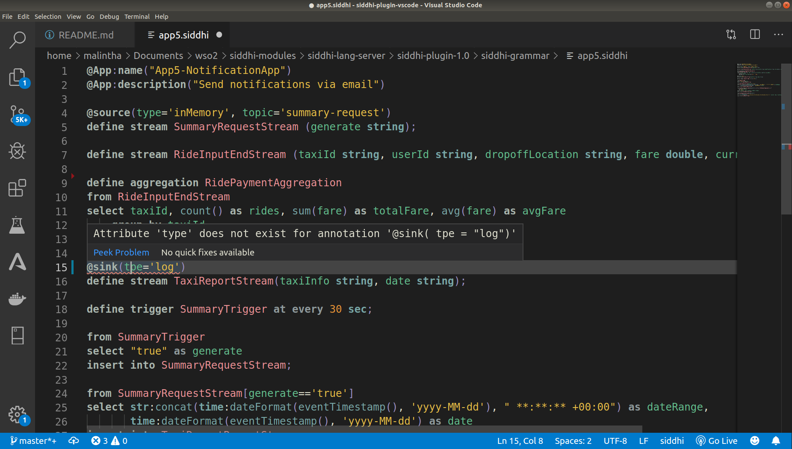
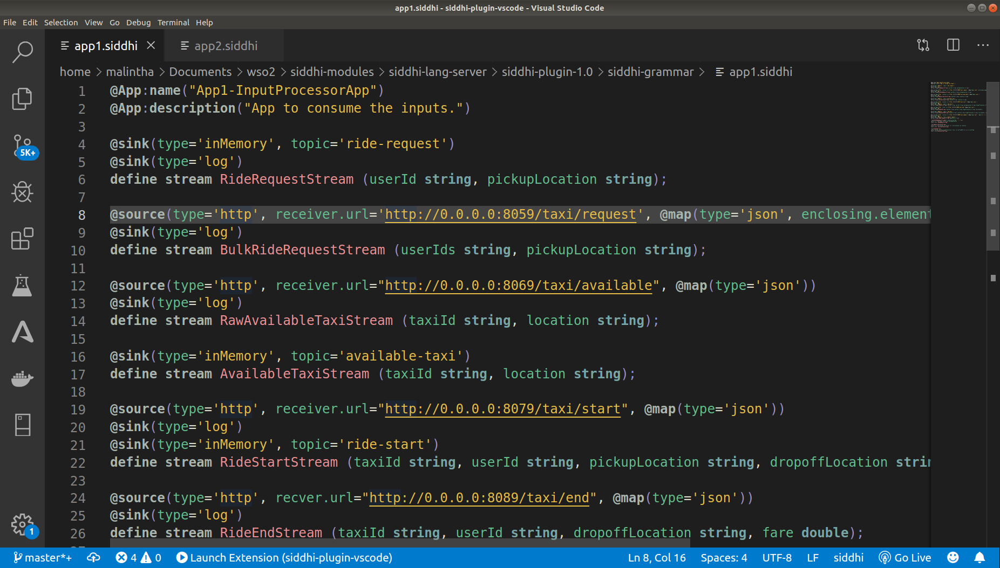
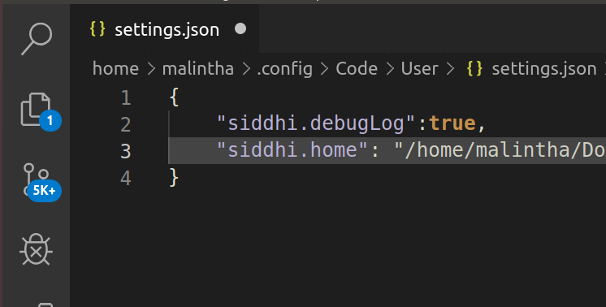

# Siddhi Extension for Visual Studio Code
VSCode Siddhi extension provides rich Siddhi development capabilities in VSCode.

# Table of Contents
* [Language Features](#language-features)
    * [IntelliSence](#intellisence)
    * [Diagnostics](#diagnostics)
    * [Syntax Highlighting](#syntax-highlighting)
* [Siddhi Language Server](#siddhi-language-server)
* [How to use the extension](#how-to-use-the-extesnion)
* [Building and debuging the extesnion](#building-and-debugging-the-extension)
* [Support and contribution](#support-and-contribution)

# Language Features
## IntelliSence
* Auto completion-Context based auto completions by Siddhi Language Server
* Snippets- Context based snippets by Siddhi Language Server

## Diagnostics
* Semantic/Syntactic error reporting as code is typed


## Syntax Highlighting
* Lexical sub-elements are highlighted in various colors based on the theme that has been activated in your VSCode editor.


# Siddhi Language Server
The extension uses Siddhi Language Server to provide language analytic capabilits using [language server protocol](https://microsoft.github.io/language-server-protocol/).

Currently, the language server is capable of providing context based auto-completions and diagnostics.

Find the implementation of the Siddhi Language Server at [https://github.com/siddhi-io/distribution](https://github.com/siddhi-io/distribution)
# How to use the extension
## Download Visual Studio Code
Download the [Visual Studio Code editor.](https://code.visualstudio.com/download)

## Installing the plugin
* Installing from VSCode editor's extension marketplace
* Download and install the plugin

### Installing from VSCode editor's extension marketplace
Click **Extensions** on the left-most menu of the editor, search for Siddhi plugin, and click Install.
>**Tip**: Click **Reload** to reload the editor to apply the change.

### Download and install the plugin
1. Download the [Visual Studio Code Siddhi plugin.]()
2. Follow either of the below approaches to install the plugin.
    * Using VSCode editor UI
    * Using Command Line

### Using VSCode editor UI
1. Click View in the top menu of the editor and click Command Palette.
2. In the search bar, type “vsix” and click Extensions: Install from VSIX
3. Browse and select the `.vsix` file of the plugin you downloaded.

### Using Command Line
In a new Command Line tab, execute the below command.

`$ code --install-extension <SIDDHI-PLUGIN-DIRECTORY>`

## Configuring Siddhi Home
 >**Note**: Siddhi distribution **version 5.1.2** or higher should be available locally.
1. Configure Siddhi home in `settings.json`
    * Press `Ctrl+Shift+P`  and type  `Open settings`. 
    * The Open Settings (JSON) command will let you directly edit the `settings.json` file.
    * add `siddhi.home:"<SIDDHI-HOME-DIRECTORY>"` to `settings.json` file as below.
    
2. Having ``SIDDHI_HOME`` as an environment variable.

# Building and Debugging the Extesnion

## Building the `.visx` file
1. Fork and Colone  [https://github.com/siddhi-io/siddhi-plugin-vscode](https://github.com/siddhi-io/siddhi-plugin-vscode)
2. execute  `npm install` in the terminal at the cloned directory, which downloads the required dependencies in the `package.json` file.
3. execute  `npm run compile` in the terminal at the cloned directory, which compiles the source code of the extension.
4. execute `npm run package` to build the `.vsix` file.

## Building Siddhi TextMate grammar file
`siddhi.tmLanguage.json` file provides [*text mate garmmar*](https://macromates.com/manual/en/language_grammars) for siddhi, which is used for syntax highlighting feature of the extension.

To build the grammar file from `siddhi.tmLanguage.yaml` file execute `npm run build-tm-grammar` in the command line at the cloned directory.

## Debugging the extension on extension host
1. Configure extension host debugging in `launch.json`
    * Press `Ctrl+Shift+P`  and type  `Open launch`. 
    * The Open launch (JSON) command will let you directly edit the  `launch.json` file.
    * Add the following configuration to `launch.json` to run the extension on extesnion host.
    ```
        {
            "type": "extensionHost",
            "request": "launch",
            "name": "Launch Extension",
            "runtimeExecutable": "${execPath}",
            "args": [
                "--extensionDevelopmentPath=${workspaceFolder}"
            ],
            "env": {
                "LSDEBUG":"true"
            },
            "outFiles": [
                "${workspaceFolder}/out/src/extension.js"
            ]
        }
    ```
    >**Note**: `"LSDEBUG":"true"` configuration is to start the Siddhi Language Server in **debug mode**, which enables remote debugging of language server.
2. Add  `"siddhi.debugLog":true` configuration to `settings.json` file to enable debug log.
3. Clone Siddhi Language Server source code from [https://github.com/siddhi-io/distribution](https://github.com/siddhi-io/distribution).
5. Start Siddhi Language Server as a remote debug process at `port 5005`
4. Refer more on debugging on extension host at [https://code.visualstudio.com/docs/nodejs/nodejs-debugging](https://code.visualstudio.com/docs/nodejs/nodejs-debugging)

# Support and contribution
You can reachout through Slack channel, Google mail group and etc. Please refer the community contribution [site](https://siddhi.io/community/) for more information.
